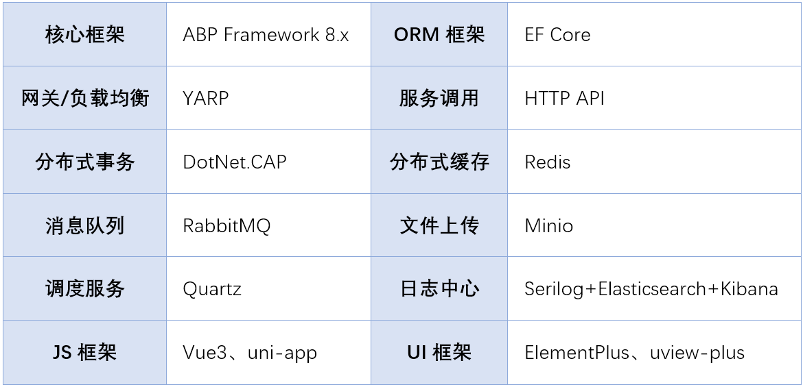

# Rex.ShopMicroService.Sample


[简体中文](./README.md) | English

A microservice-based e-commerce platform built on **ABP Framework 8.x, MySQL, MongoDB, Redis, RabbitMQ, CAP, ElasticSearch, Minio, and YARP**.  
It adopts a mainstream internet architecture, modern UI design, visual layout, and supports cluster deployment.  
The platform provides a wide range of marketing features such as promotions, coupons, and flash sales.  
The source code is completely open-source with no secondary encapsulation, making it an excellent case study for secondary development.

---

## Preface

This mall project is designed to provide medium and large enterprises with a fully functional, easy-to-maintain microservice e-commerce platform, implemented with mainstream microservice technologies.  
The admin backend system includes modules such as system management, permission management, membership management, product management, order management, operations management, promotion management, and financial management.

---

## Directory Structure

```
Rex.ShopMicroService.Sample
├─00.Core -- Core common module (shared code base)
├─01.App -- Application side
│  ├─Rex.App.UniApp  -- Mini Program client
│  ├─Rex.App.WebAdmin  -- Admin backend
├─02.Gateways -- Gateways
│  ├─Rex.Shop.WebGateway  -- Backend gateway
│  ├─Rex.Shop.WebPublicGateway  -- Frontend (public) gateway
├─03.AggregationServices -- Aggregation Services
│  ├─Rex.BackendAggregationService  -- Backend aggregation service
│  ├─Rex.FrontAggregationService  -- Frontend aggregation service
├─04.MicroServices -- Microservices
│  ├─Rex.AuthService.HttpApi.Host  -- Authentication & Authorization service
│  ├─Rex.BaseService.HttpApi.Host  -- Base service (users, roles, menus, settings, etc.)
│  ├─Rex.GoodService.HttpApi.Host  -- Product service
│  ├─Rex.OrderService.HttpApi.Host  -- Order service
│  ├─Rex.PaymentService.HttpApi.Host  -- Payment service
│  ├─Rex.PromotionService.HttpApi.Host  -- Promotion service
├─05.Modules -- Modules layer
│  ├─Rex.AuthService  -- Authentication & Authorization module
│  ├─Rex.BaseService  -- Base service module
│  ├─Rex.GoodService  -- Product module
│  ├─Rex.OrderService  -- Order module
│  ├─Rex.PaymentService  -- Payment module
│  ├─Rex.PromotionService  -- Promotion module
```

---

## Technology Stack



---

## System Architecture


---

## Running & Debugging

```
# Clone project
git clone https://gitee.com/zhuyongzhengs/Rex.ShopMicroService.Sample.git

# Create MySQL databases
Databases required: Rex.Shop.BaseService, Rex.Shop.GoodService, Rex.Shop.OrderService, Rex.Shop.PaymentService, Rex.Shop.PromotionService  
(or create via EF Core migration)  
After creating databases, import base data for debugging.  
SQL scripts are located in: ~/Rex.ShopMicroService.Sample/db directory.

# Start middleware services
Redis, MongoDB, RabbitMQ, Minio

# Run the project
Make sure all middleware connection strings are correctly configured in the project.

1. After successful compilation, start services ---> Double-click "start.test.bat" (Note: Be cautious if memory < 16GB ＞﹏＜ )  
2. Once services are running, start: WebAdmin (Admin backend), UniApp (WeChat Mini Program)  
3. Admin account credentials  
   - Username: `admin`  
   - Password: `1q2w3E*`
```

---

## API Endpoints (after deployment)

| Service                                               | Address                |
| ----------------------------------------------------- | ---------------------- |
| Rex.Shop.WebGateway (Backend Gateway)                 | https://localhost:4444 |
| Rex.Shop.WebPublicGateway (Public Gateway)            | https://localhost:4433 |
| Rex.BackendAggregationService (Backend Aggregation)   | https://localhost:4410 |
| Rex.FrontAggregationService (Frontend Aggregation)    | https://localhost:4420 |
| Rex.AuthService.HttpApi.Host (Auth Service)           | https://localhost:4466 |
| Rex.BaseService.HttpApi.Host (Base Service)           | https://localhost:4455 |
| Rex.GoodService.HttpApi.Host (Product Service)        | https://localhost:4477 |
| Rex.OrderService.HttpApi.Host (Order Service)         | https://localhost:5500 |
| Rex.PaymentService.HttpApi.Host (Payment Service)     | https://localhost:5510 |
| Rex.PromotionService.HttpApi.Host (Promotion Service) | https://localhost:4488 |
| Rex.App.WebAdmin (Admin Platform)                     | http://localhost:5120  |
| Rex.App.UniApp (H5 / Mini Program)                    | http://localhost:5130  |

---

## Screenshots

### 1. Admin Backend

  
  
  
  
  
  
  
  
  
  
  
  

### 2. Mini Program

  
  
  
  
  
  

---

## Support the Author

If this project helped you, please give it a ⭐ Star on [Gitee](https://gitee.com/zhuyongzhengs/Rex.ShopMicroService.Sample)  or [Github](https://github.com/zhuyongzhengs/Rex.ShopMicroService.Sample).  
Your support and encouragement mean a lot!

---

## Your encouragement is our motivation to move forward ~
