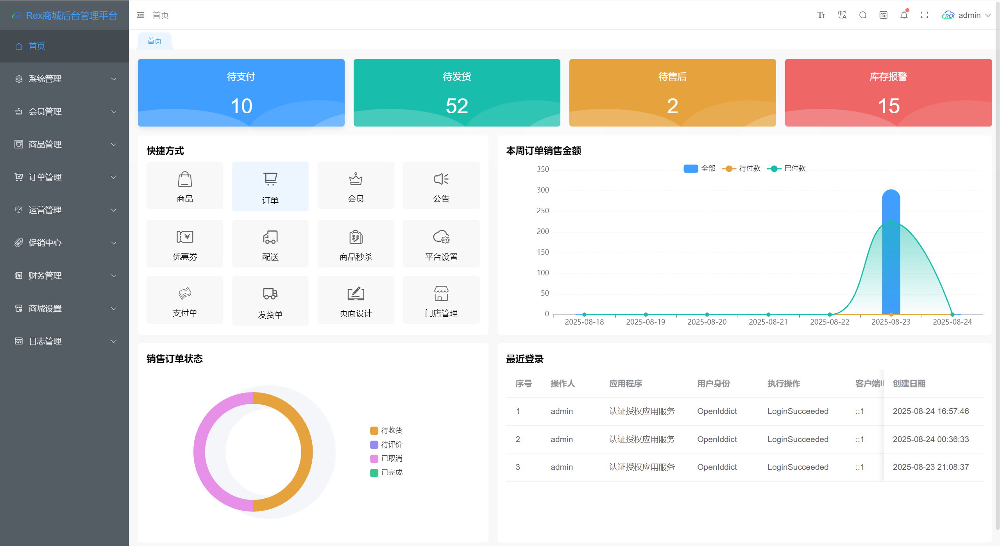
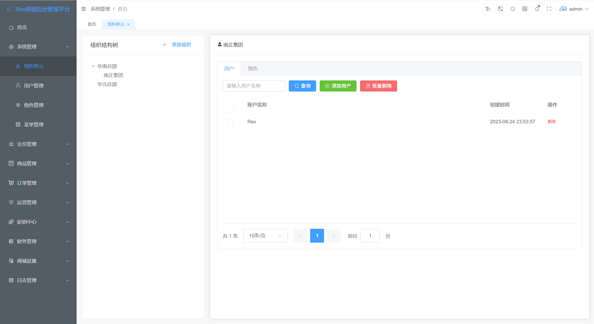
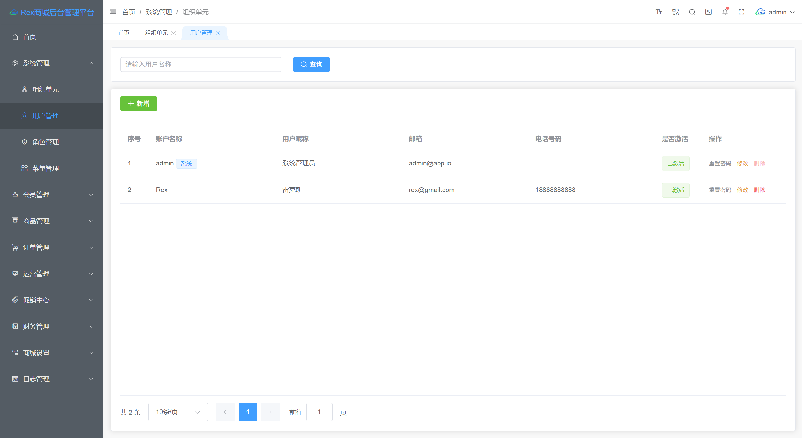
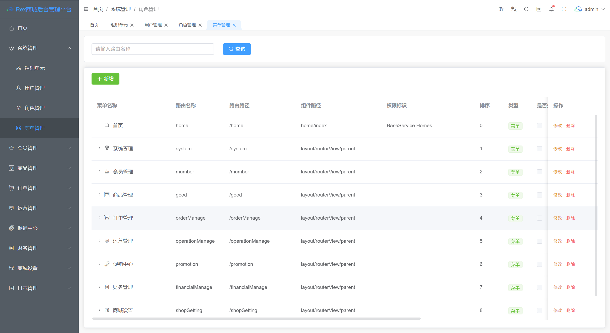
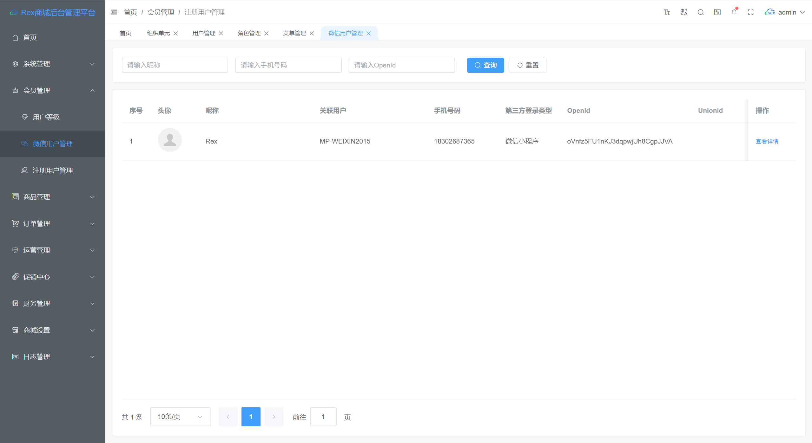
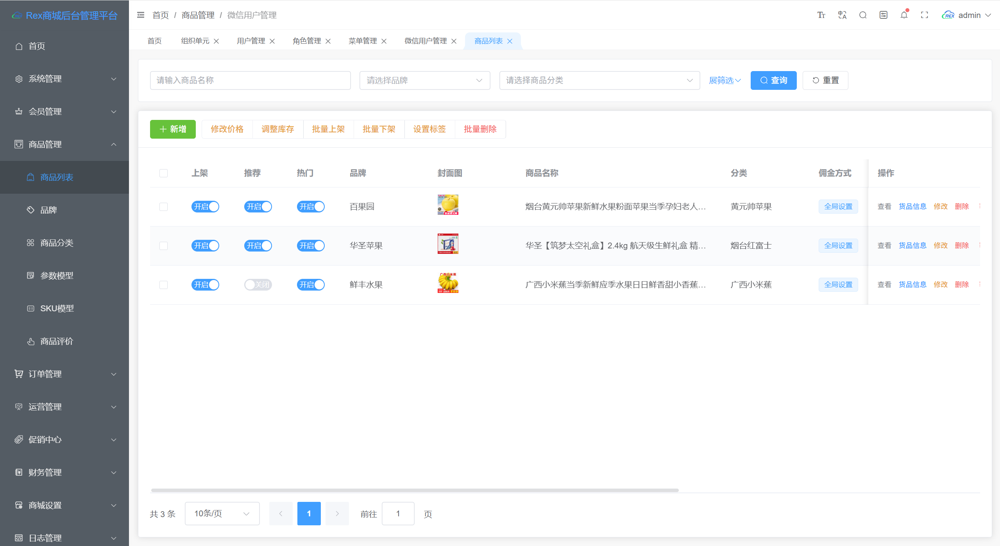

简体中文 | [English](./README.en.md)

一个基于ABP Framework 8.x、Mysql、MongoDB、Redis、RabbitMQ、CAP、ElasticSearch、Minio、YARP的微服务电商商城平台，采用主流的互联网技术架构、全新的UI设计、可视化布局、支持集群部署；拥有活动促销、优惠卷、商品秒杀等众多完整的营销功能，代码完全开源，没有任何二次封装，是一个非常适合二次开发的电商平台案例。

## 前言

本商城致力于为中大型企业打造一个功能完整、易于维护的微服务电商商城平台，采用主流微服务技术实现；后台管理系统包含系统管理、权限管理、会员管理、商品管理、订单管理、运营管理、促销管理、财务管理等模块。

## 目录结构

```
Rex.ShopMicroService.Sample
├─00.Core -- 公共模块核心（公共中的公共代码）
├─01.App -- 应用端
│  ├─Rex.App.UniApp  -- 小程序客户端
│  ├─Rex.App.WebAdmin  -- 后台管理端
├─02.Gateways -- 网关
│  ├─Rex.Shop.WebGateway  -- 后台网关
│  ├─Rex.Shop.WebPublicGateway  -- 前台(公共)网关
├─03.AggregationServices -- 聚合服务
│  ├─Rex.BackendAggregationService  -- 后台聚合服务
│  ├─Rex.FrontAggregationService  -- 前台聚合服务
├─04.MicroServices -- 商品微服务
│  ├─Rex.AuthService.HttpApi.Host  -- 认证授权服务
│  ├─Rex.BaseService.HttpApi.Host  -- 基础服务(用户、角色、菜单、设置等)
│  ├─Rex.GoodService.HttpApi.Host  -- 商品服务
│  ├─Rex.OrderService.HttpApi.Host  -- 订单服务
│  ├─Rex.PaymentService.HttpApi.Host  -- 支付服务
│  ├─Rex.PromotionService.HttpApi.Host  -- 活动促销服务
├─05.Modules -- 模块层
│  ├─Rex.AuthService  -- 认证授权模块
│  ├─Rex.BaseService-- 基础服务模块
│  ├─Rex.GoodService-- 商品模块
│  ├─Rex.OrderService-- 订单模块
│  ├─Rex.PaymentService-- 支付模块
│  ├─Rex.PromotionService-- 促销模块

```

## 技术选型


## 系统架构图


## 调试运行

```
# 克隆项目
git clone https://github.com/zhuyongzhengs/Rex.ShopMicroService.Sample.git

# 创建MySQL数据库
创建数据库：Rex.Shop.BaseService、Rex.Shop.GoodService、Rex.Shop.OrderService、Rex.Shop.PaymentService、Rex.Shop.PromotionService 或通过EF Core进行迁移~
创建数据库完成之后，导入基础数据进行调试。数据库脚本位于：~/Rex.ShopMicroService.Sample/db目录下。

# 启动中间件服务
Redis、MongoDB、RabbitMQ、Minio

# 运行项目
启动前确保项目中的中间件连接地址配置正确
1.项目编译成功之后，启动服务 ---> 双击“start.test.bat”脚本(注：内存低于16GB的慎重 ＞﹏＜ )
2.服务启动成功之后，再启动：WebAdmin(商城后台管理)、UniApp(微信小程序)
3.后台管理员账号
默认账号：admin
默认密码：1q2w3E*
```

## 商城服务部署后 API 地址

| 服务                                     | 地址                     |
| -------------------------------------- | ---------------------- |
| Rex.Shop.WebGateway 后台网关               | https://localhost:4444 |
| Rex.Shop.WebPublicGateway 公共网关         | https://localhost:4433 |
| Rex.BackendAggregationService 后台聚合服务   | https://localhost:4410 |
| Rex.FrontAggregationService 前台聚合服务     | https://localhost:4420 |
| Rex.AuthService.HttpApi.Host 认证授权服务    | https://localhost:4466 |
| Rex.BaseService.HttpApi.Host 基础服务      | https://localhost:4455 |
| Rex.GoodService.HttpApi.Host 商品服务      | https://localhost:4477 |
| Rex.OrderService.HttpApi.Host 订单服务     | https://localhost:5500 |
| Rex.PaymentService.HttpApi.Host 支付服务   | https://localhost:5510 |
| Rex.PromotionService.HttpApi.Host 促销服务 | https://localhost:4488 |
| Rex.App.WebAdmin 商城后台管理平台              | http://localhost:5120  |
| Rex.App.UniApp H5/小程序                  | http://localhost:5130  |

## 代码运行相关截图

### 1.后台截图









### 2.小程序截图


## 支持作者

如果帮助到了你，希望你可以去[Gitee](https://github.com/zhuyongzhengs/Rex.ShopMicroService.Sample)  或 [Github](https://github.com/zhuyongzhengs/Rex.ShopMicroService.Sample)帮我点个 ⭐ Star，这将是对我极大的鼓励与支持。

## 你的点赞鼓励，是我们前进的动力~

## 你的点赞鼓励，是我们前进的动力~

## 你的点赞鼓励，是我们前进的动力~
